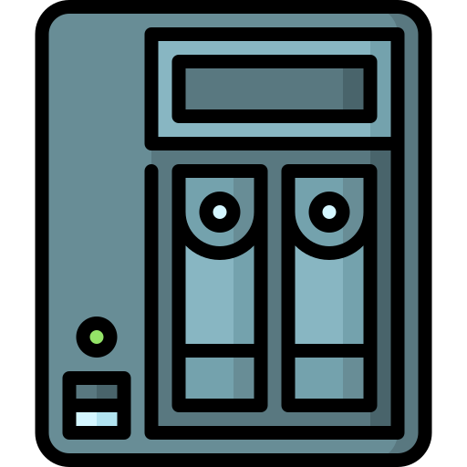

# OpenMediaVault System : Configure

## Table Of Contents

- [OpenMediaVault System : Configure](#openmediavault-system--configure)
  - [Table Of Contents](#table-of-contents)
  - [Configure Credentials](#configure-credentials)
  - [Grant some access (SSH, UI)](#grant-some-access-ssh-ui)
  - [Configure Dashboard and System](#configure-dashboard-and-system)
  - [Next](#next)

## Configure Credentials

First of all, you need to change the default credentials by one of your choice :

Connect to the OpenMediaVault UI [here](http://192.168.X.X) with these default credentials :

- **Username** : admin
- **Password** : openmediavault

Click on the top settings icon and choose change password, change the default password.

You can also setup other users and group to setup some permission to access to this UI or some share folder next :

1) Go to **Users/Groups**
2) Here you can create and edit some groups where you can register some users.
3) Go to **Users/Users**
4) Here you can create and edit some users.

## Grant some access (SSH, UI)

If you want to use another user to connect to the UI or just access to the SSH of your machine, you need to configure some groups for your users :

1) Go to **Users/Users**
2) Select or create a new users.
3) Add some groups to it :

- **docker** : Grant Docker Access wihtout sudo privilege.
- **openmediavault-*** : Grant some OpenMediaVault permissions.
- **ssh** : Grant SSH access.

## Configure Dashboard and System

Next you have some basic configuration to do on the system :

1) Go to **Dashboard**
2) Click on settings page to configure what you want to display on the main dashboard page.
3) Go to **System/User Interface**
4) Change the port of the server if you want, and check the **SSL/TLS activate**
5) Configure a new certificate if you want and check **force SSL/TLS**
6) Go to **System/Monitoring** and check activate to get some metrics.

If you want, you have a plenty of functionality available to configure (notifications, tasks, ...)

There are also plenty of plugins to do what you want.

## Next

You can [configure your storage with ZFS](./storage.md).
