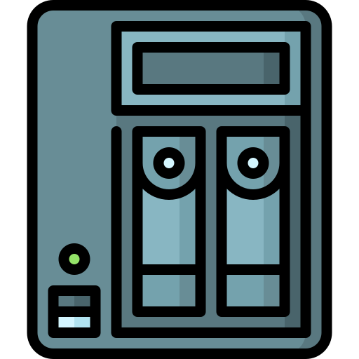

# OpenMediaVault System : Install



## Table Of Contents

- [OpenMediaVault System : Install](#openmediavault-system--install)
  - [Table Of Contents](#table-of-contents)
  - [Install Debian](#install-debian)
  - [Install OpenMediaVault](#install-openmediavault)
  - [Install Docker](#install-docker)
  - [Install Portainer](#install-portainer)
  - [Install Yacht](#install-yacht)
  - [Next](#next)

## Install Debian

First of all you need to install a Operating System before install OpenMediaVault, One of the best to install is Debian, it's perfect to setup a server.

We'll use Debian 11 to install OMV 6 :

1) Prepare an USB Boot Key with Debian 11, here the [documentation](https://progdevlab.gitlab.io/dyntools/#/docs/global/boot).
2) Now you can boot on this USB Key and install Debian 11 (enter **localhost** as hostname), here some [documentation](https://progdevlab.gitlab.io/dyntools/#/docs/linux/debian) to fix some problem.

> If you use the great ODROID HC4 ARM machine, here a [documentation](https://progdevlab.gitlab.io/dyntools/#/docs/machine/odroid_hc4) to install Debian 11 on it.

First setup the SUDO system and add your main user in the SUDO group, you need also to setup a fixed IP address, use this debian [documentation](https://progdevlab.gitlab.io/dyntools/#/docs/linux/debian).

Now you need to install some dependency for the base of this system :

```bash
sudo apt update

sudo apt upgrade -y

sudo apt install -y \
    wget \
    curl \
    htop \
    vim \
    git \
    screen
```

## Install OpenMediaVault

To install OpenMediaVault, we will use an [automated script](https://github.com/OpenMediaVault-Plugin-Developers/installScript) to install both OMV and OMV Extra with all dependency we need.

Connect to your server with SSH and enter these commands :

```bash
sudo wget -O - https://github.com/OpenMediaVault-Plugin-Developers/installScript/raw/master/install | sudo bash
```

You have a great guide for OpenMediaVault [here](https://openmediavault.readthedocs.io/en/5.x/new_user_guide/newuserguide.html) and another for OpenMediaVault Extra [here](https://wiki.omv-extras.org/).

Finally you can access to your OpenMediaVault UI [here](http://192.168.X.X) with these default credentials (to change !) :

- **Username** : admin
- **Password** : openmediavault

Next you have to configure the network (configure it on the web UI) :

1) Go to **Network/Interfaces**
2) Select your main network interface and edit it
3) Activate the Wake On Lan System
4) Put in DNS Servers your DNS Server (192.168.1.1,1.1.1.1,8.8.8.8)

## Install Docker

Now you have OpenMediaVault and Extra installed, you can install Docker automatically with it, go to the web UI :

1) Go to **System/omv-extras/Docker**
2) Click on **Install**

## Install Portainer

Now you have Docker and Docker Compose installed, you can install Portainer to manage your container, go to the web UI :

1) Go to **System/omv-extras/Portainer**
2) Click on **Install**
3) After install, click on **Open Web**
4) Create your fist admin account
5) Choose Getting Started and setup with a local Docker installation

## Install Yacht

Now you have Docker and Docker Compose installed, you can install Yacht to manage the deployment of container on your server, go to the web UI :

1) Go to **System/omv-extras/Yacht**
2) Click on **Install**
3) After install, click on **Open Web**
4) Login with the **default credentials** :
   1) **Email** : admin@yacht.local
   2) **Password** : pass
5) Go to your user settings and change your email and password

## Next

You can [configure you installation](./configure.md).
